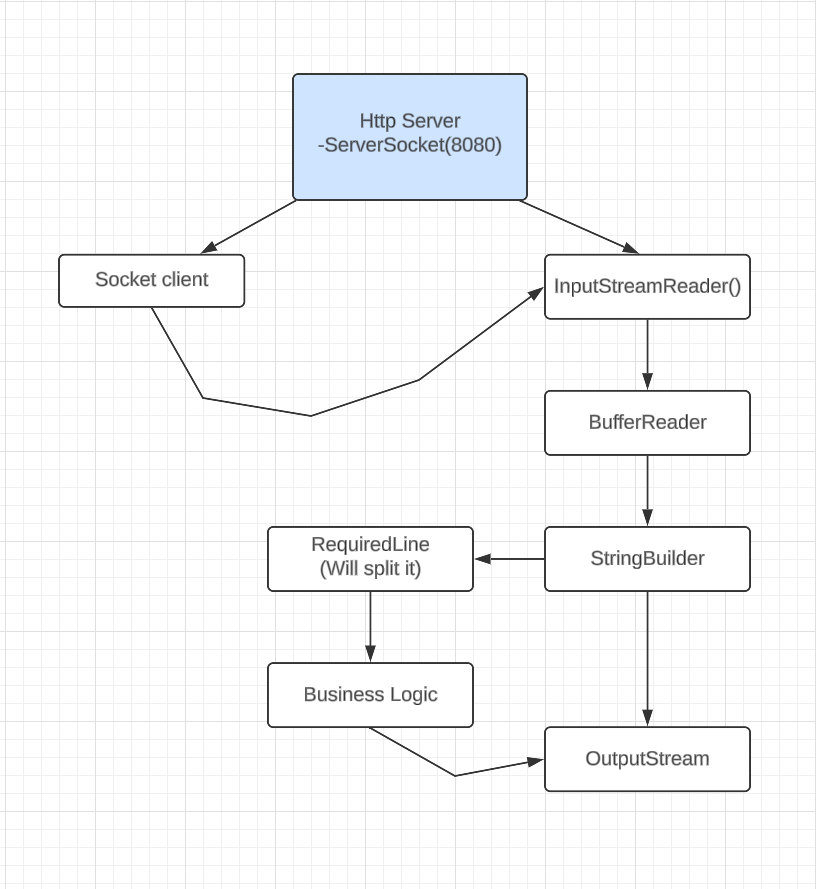

## RoutesXplore : HTTP Server in Java
This project implements a basic HTTP server in Java, responding to three predefined routes:
 * /hello: Returns a simple "Hello World" message.
 * /image: Serves an image file (image_for_http_response.jpg) stored in the project directory.
 * For any other route: Responds with a generic "What ya lookin at?" message.

### Features:
 * Listens on port `8080` by default (can be customized).
 * Handles basic HTTP GET requests.
 * Supports serving static content (image in this example).
 * Factory design pattern is used for Loose coupling between moduels.

 ### Flow chart:
 * Control Flow:
 

### Getting Started:
 * Prerequisites:
   * Java Development Kit (JDK) 8 or later (https://docs.oracle.com/en/java/javase/11/install/overview-jdk-installation.html)
 * Compiling:
   * Open a terminal in the project directory.
   * Run javac http_server.java. This will create the http_server.class file.
 * Running:
   * Execute java http_server

#### Usage:
Point your web browser to http://localhost:8080/ to see the default response. Access /hello or /image for the respective content.

#### Customization:
 * To change the port, modify the ServerSocket(8080) line in main. Remember that ports below 1024 may require root privileges.
 * You can add additional routes and modify the response logic based on your needs. Refer to the server code for details.

#### Note:
 * This is a basic implementation and does not handle advanced features like security, complex request handling, or error handling.

### Further Development:
 * Implement routing for more dynamic content.
 * ✅Embedding the Design Pattern for Low Latency, High Throughput and of course more Readability.
 * Enhance error handling for a more robust server.
 * Explore advanced features like Threading and error handling.
 * Refactor the code.